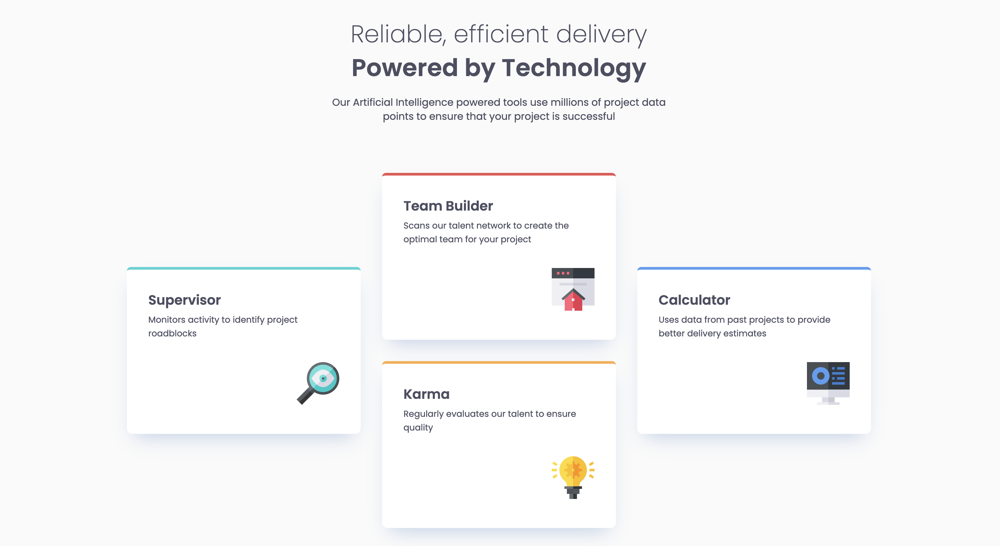

# Frontend Mentor - Four card feature section solution

This is a solution to the [Four card feature section challenge on Frontend Mentor](https://www.frontendmentor.io/challenges/four-card-feature-section-weK1eFYK). Frontend Mentor challenges help you improve your coding skills by building realistic projects.

## Table of contents

-   [Frontend Mentor - Four card feature section solution](#frontend-mentor---four-card-feature-section-solution)
    -   [Table of contents](#table-of-contents)
    -   [Overview](#overview)
        -   [The challenge](#the-challenge)
        -   [Screenshot](#screenshot)
        -   [Links](#links)
    -   [My process](#my-process)
        -   [Built with](#built-with)
        -   [What I learned](#what-i-learned)
            -   [This function converts px units to rem](#this-function-converts-px-units-to-rem)
            -   [This is a simple way to use breakpoint and media queries](#this-is-a-simple-way-to-use-breakpoint-and-media-queries)
            -   [This gives the font a min/max and a smooth transition in between as the screen size changes](#this-gives-the-font-a-minmax-and-a-smooth-transition-in-between-as-the-screen-size-changes)
        -   [Continued development](#continued-development)
        -   [Useful resources](#useful-resources)
    -   [Author](#author)

**Note: Delete this note and update the table of contents based on what sections you keep.**

## Overview

### The challenge

Users should be able to:

-   View the optimal layout for the site depending on their device's screen size

### Screenshot



### Links

-   Solution URL: [https://github.com/EmLopezDev/Four-Card-Feature-Section](https://github.com/EmLopezDev/Four-Card-Feature-Section)
-   Live Site URL: [https://emlopezdev.github.io/Four-Card-Feature-Section/](https://emlopezdev.github.io/Four-Card-Feature-Section/)

## My process

### Built with

-   Semantic HTML5 markup
-   SCSS wth function and mixins
-   Flexbox

### What I learned

One of the biggest learning were using `SCSS` functions and mixins. The make righting re-useable bits of CSS so much easier.

##### This function converts px units to rem

```scss
@function rem($pixel) {
    @if math.is-unitless($pixel) {
        @return math.div($pixel, 16) + rem;
    } @else {
        @error "Don't use units when using the rem() function; only numbers.";
    }
}
```

##### This is a simple way to use breakpoint and media queries

```scss
$breakpoints: (
    "small": f.em(768),
    "medium": f.em(1200),
);

@mixin breakpoint($size) {
    @media (max-width: map-get($breakpoints, $size)) {
        @content;
    }
}
```

Another learn was a great approach on how to make font-sizes responsive using `clamp()`

##### This gives the font a min/max and a smooth transition in between as the screen size changes

```css
.text-preset-1 {
    font-size: 1.5rem;
    font-size: clamp(
        1.5rem,
        0.16666666666666674rem + 2.7777777777777777vw,
        2.25rem
    );
}
```

### Continued development

-   I want to continue working on making sites responsive which includes layouts and elements like font-size.
-   I also want to dive into making them a bit more accessibility friendly.

### Useful resources

-   [SCSS](https://www.youtube.com/watch?v=jfMHA8SqUL4&t=477s) - This helped get a better understanding of using functions and mixins in SCSS
-   [Fluid Typography](https://royalfig.github.io/fluid-typography-calculator/) - This is a neat tool to help calculate the best font-size to use for optimal responsiveness

## Author

-   Frontend Mentor - [@EmLopezDev](https://www.frontendmentor.io/profile/EmLopezDev)
